# ZoekDePot v2 — Blender pipeline

The photoreal rebuild described in [`docs/modernization-plan.md`](../docs/modernization-plan.md)
(Option A). The 3D model is **generated by scripts** from the same
`data/model.json` that v1 and the PDF checks use, then finished and baked in
Blender. A web viewer (Phase 3) will load the exported `.glb`.

v1 stays untouched and live until v2 is better.

## Status

| Phase | | |
|---|---|---|
| 0 | Freeze v1 | ✅ `v1` = `main` @ `620add7` (create the `v1` tag on GitHub: Releases → new tag on that commit) |
| 1 | Shell generated in Blender | ✅ walls with real openings, floors/ceilings per room, frames, schuifpuien, railings — checked against `model.json` |
| 2a | Furniture, kitchen, sanitary ware, lamps, wall tiles, plinths | ✅ from `v2/data/furniture.json`, checked against the walls |
| 2b | Photoreal textures | ✅ CC0 Poly Haven scans via `v2/data/materials.json`; untreated oak plank floor and bathroom tiles composed from scans |
| 2c | Baked lighting (day / evening / night) for the viewer | ✅ pipeline + draft bake in the cloud; final bake on the laptop GPU (see below) |
| 3 | Web viewer core | in progress: `v2/web/` — loads the baked model, lightmaps per mood, walking with collision |
| 4–6 | Features, deploy, extras | — |

## Preview (Phase 2b: furnished and textured, CPU draft)

| | |
|---|---|
| 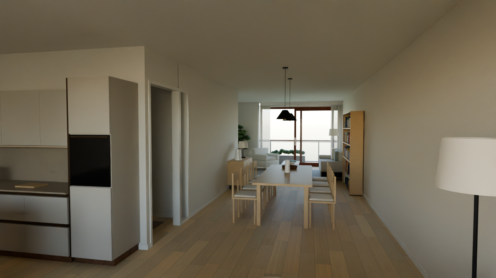 | 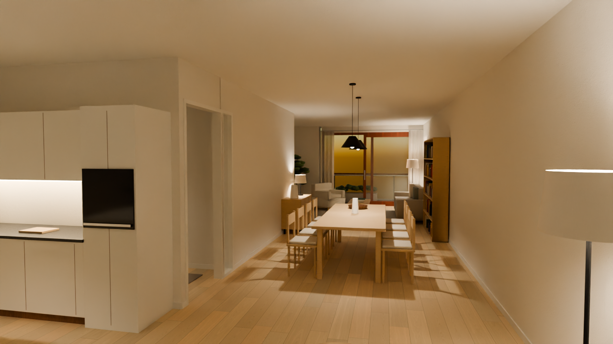 |
| 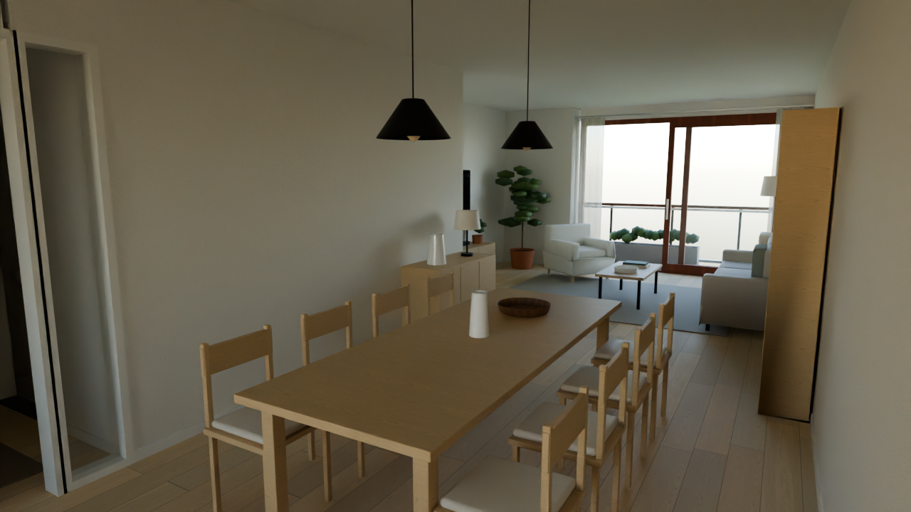 | 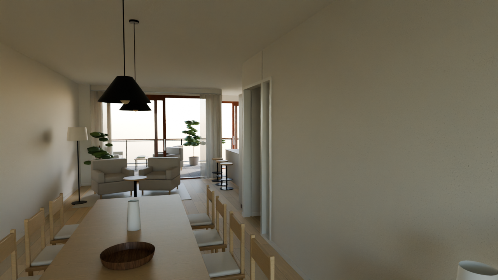 |
| 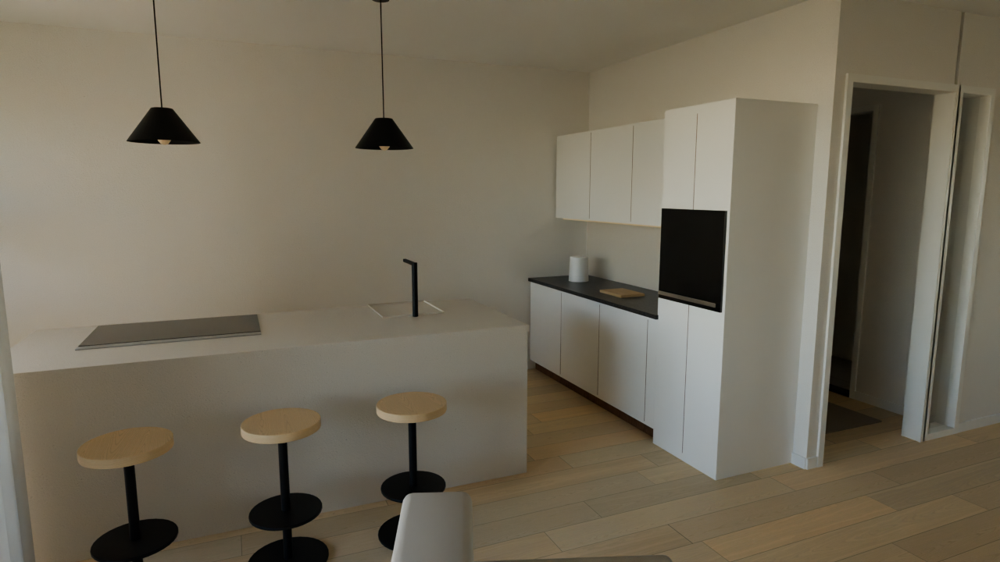 | 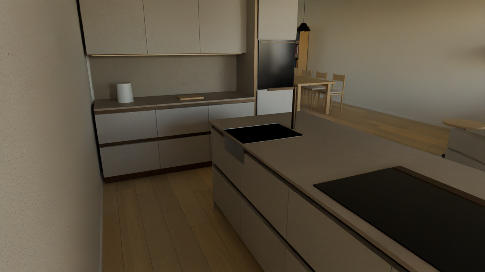 |
| 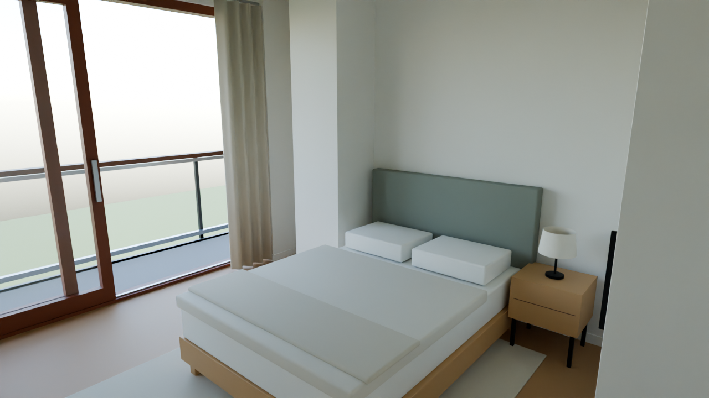 | |
| 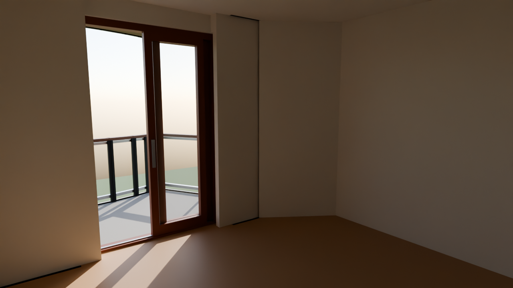 | 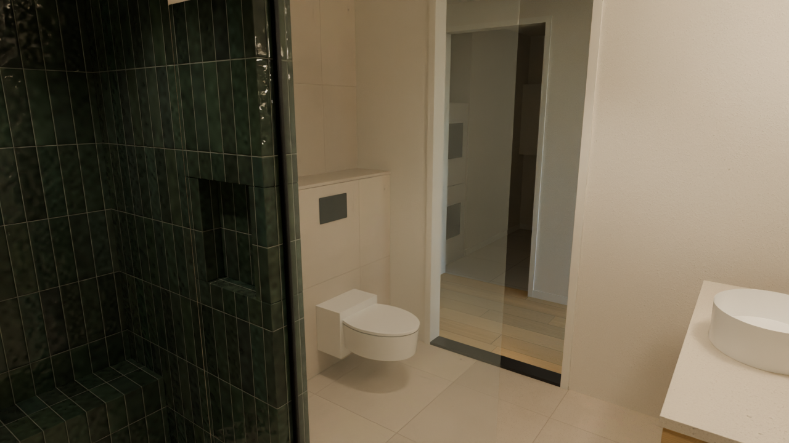 |
| 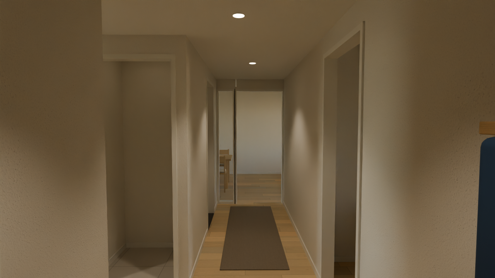 | 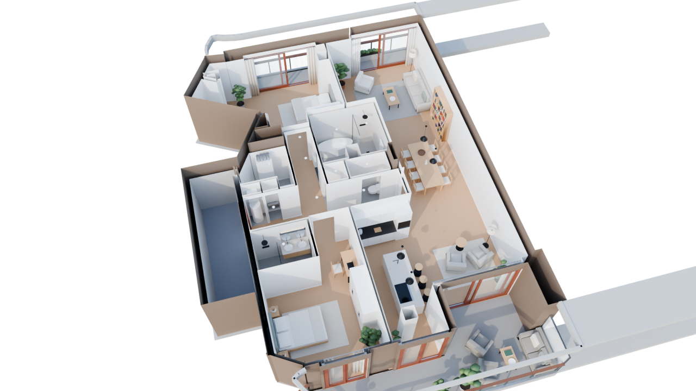 |

Day views: sky + sun for Den Haag at 15:30 in late April, lamps off except
in the windowless gang and the bathroom. `avond`: sunset in the west-north-
west with every lamp on. Known open point:
hairline shadow gaps at the slaapkamer 2 alcove pier and the slanted SW wall
(room outline and wall face more than 5 cm apart in `model.json`).

## Furniture

`v2/data/furniture.json` is the layout: one entry per piece with its
position, rotation and size, in the same frame as `model.json`. Pieces marked
`"own": true` are the owners' real ones (both beds 140x200, the dining table
260x100); everything else is a suggestion. Positions come from v1's
walk-tested layout. Edit sizes or positions there, then run
`check_furniture.py`: it fails when a piece hits a wall, door opening or
another piece, or leaves its room.

| Room | Pieces |
|---|---|
| Woonkamer, zithoek | 3-zitsbank 240x95 (linnen), bouclé fauteuil, salontafel 120x60 eiken, tv-meubel 180 + 65" tv, boekenkast 180x210, vloerkleed 300x250, vloerlamp, plant |
| Woonkamer, eethoek | **eigen tafel 260x100**, 8 eiken stoelen met linnen zitkussen, 2 hanglampen, dressoir 120x45 met tafellamp |
| Keuken | **eigen keuken: SieMatic SLX** volgens de keukentekeningen (greeploos, mat gelakte fronten licht greige, bronskleurige greepkanalen), werkblad **Caesarstone 4230 Shitake**. Hoge kastenwand 2,57 m tot aan het plafond (extra rij kasten) met twee zwarte Siemens-ovens en de Siemens inbouwkoelkast; kookeiland 2574 x 1000 x 950 met Siemens inductie + afzuiging, Franke Maris spoelbak + Lina XL kraan in Coffee, vaatwasser, twee krukken in het midden; 2 hanglampen |
| Woonkamer, zuid | 2 linnen fauteuils + bijzettafel bij de grote pui, vloerkleed, vloerlamp, planten, vitrage |
| Slaapkamer 1 | **eigen bed 140x200** met gestoffeerd hoofdbord, nachtkastje + lamp, kledingkast 160x60x230, leesstoel + lamp in de NW-punt, verduisterend linnen |
| Slaapkamer 2 | **eigen bed 140x200**, 2 nachtkastjes, kledingkast 200x60x230, bureau 120x60 met stoel in de nis |
| Badkamer (nieuwe indeling) | **eigen ontwerp**: wastafel met spiegel + radiator op de noordwand; douchetoilet op een voorzetwand (toiletgedeelte); inloopdouche met wandje met nis tegen de kolom, glazen douchewand, regendouche uit het plafond, douchegoot en getegeld bankje. Tegels: vloer + toiletgedeelte lichte beige steenlook 60x60, noord- en oostwand grijze reliëftegel, douche Grespania Rambla 7,5x30 groen (staand) |
| Kleine badkamer, toilet | inloopdouche, dubbele wastafel, designradiator; hangtoilet op voorzetwand, fontein |
| Gang, berging | kapstok + schoenenbank, loper, inbouwspots; WTW, boiler, verdeler, wasmachine + droger |
| Balkons | noord: bistroset + plantenbak; zuid: loungebank, 2 stoelen, tafel, planten |

Furniture objects are `furn.<id>` (hard parts, 4 mm bevel), `furn.<id>.soft`
(upholstery and bedding, rounded), `furn.<id>.blob` (foliage, bulbs) and
`furn.<id>.curtain`; lamps add real light sources `light.<id>` with their
room as a property.

## Surfaces (textures)

`v2/data/materials.json` holds every finish: which CC0 scan from
[Poly Haven](https://polyhaven.com) it uses, its colour, roughness and
size. `textures.py` downloads the scans once (cache: `v2/assets/cache/`,
not committed) and writes the final maps to `v2/build/textures/`.

| Finish | How |
|---|---|
| **Vloer: eiken lamel, onbehandeld** | composed plank by plank from two raw-oak scans (`oak_veneer_03`, `silver_oak_veneer_01`): 19 cm wide, 1.0–2.2 m long, staggered, fine V-groove, matt (roughness 0.70), running north–south. Colour `#D5C2A2`. |
| Badkamertegels | composed from a height map (grout recess, bevels, relief, glaze waves): main bathroom per the owners' samples — beige stone look 60x60 with speckles (floor, toilet section), grey-beige relief tile (north + east wall, hexagon relief approximated), Grespania Rambla 7.5x30 glossy green with handmade undulation (shower); other wet rooms 60x60 floor, 30x60 wall |

Per-room finishes live under `"rooms"` in `materials.json`: the floor
material and wall rules (which wall, optional x/z range → material), first
match wins. The main bathroom uses them to mix three tiles and paint.
| Wanden, plafonds | `white_stucco`, tinted (walls stay repaintable) |
| Linnen, bouclé, jute, wol | `rough_linen`, `curly_teddy_natural`, `hessian_230`, `poly_wool_herringbone`, each recoloured |
| Kozijnen (Red Grandis), gevel (Basralocus) | `sapele_veneer`, `wood_planks_grey` |
| Meubels | light oak (`oak_veneer_03`), dark oak (`oak_veneer_01`) |
| Keuken | SLX fronts `#BDB7AE` matt, grip rails bronze metal `#6B5A49`, worktop Shitake `#A89B8A` on `plastered_wall_04` (fine sandy grain); colours read from the owners' sample photo |

Change a colour, plank width or tile size in `materials.json`, then run
`textures.py` (add `--only floor_hout` to redo one) and the build scripts.
Without textures (as in CI) everything falls back to flat colours.

The environment needs network access to `polyhaven.com`, `api.polyhaven.com`
and `dl.polyhaven.org` for the downloads.

## Baked lighting (Phase 2c)

`bake.py` bakes the light of each mood (`day`, `evening`, `night`; defined
in `lighting.py`, shared with the path-traced previews) into lightmaps for
the web viewer:

1. every static surface gets a second UV map (`Lightmap`, glTF `TEXCOORD_1`),
   packed into one atlas per group: `shell` (walls, floors, ceilings, frames,
   railings) and `furniture`;
2. Cycles bakes **light only** (direct + indirect irradiance, no surface
   colour) — so a repainted wall keeps its light and shadows;
3. OpenImageDenoise cleans it, and it is stored as an sRGB 8-bit PNG plus a
   `scale` in `v2/build/lightmaps/manifest.json`;
4. `scene.glb` holds the whole furnished apartment with both UV maps.

The viewer draws: **colour = albedo x lightmap x scale** (three.js:
`material.lightMap` in sRGB, `lightMapIntensity = scale x pi`). Glass, lamps'
bulbs and the exterior are not baked.

`preview_lightmaps.py` renders the scene the way the viewer will (every
baked surface = albedo x lightmap, all real lights off) next to the
path-traced render (`docs/renders/lmcompare_<view>.png`) to check the bake.

| Quality | Where | Lightmaps | Time |
|---|---|---|---|
| `draft` (default) | cloud CPU | 2048 px, 64 samples | ~10 min per map |
| `final` | laptop, GPU | 4096 px, 1024 samples | minutes per map on a recent GPU |

On the laptop (Blender 4.5 LTS):

```sh
git pull
python v2/blender/textures.py                       # or reuse a copied v2/build/textures
blender -b -P v2/blender/build_shell.py
blender -b -P v2/blender/build_furniture.py
blender -b -P v2/blender/bake.py -- --quality final
```

Cycles bakes every selected object separately and re-syncs the scene each
time (~2 s per object), so `bake.py` bakes each group as one temporary
joined copy: 370 objects → one bake per group.

## Web viewer (Phase 3)

`v2/web/` — Vite + TypeScript + three.js (r186). It shows the baked model
exactly as `preview_lightmaps.py` predicts: every baked surface is
albedo x lightmap x scale (`material.lightMap`, sRGB, `lightMapIntensity =
scale x pi` because three.js treats a light map as irradiance), unbaked
exterior pieces are unlit and dimmed per mood, glass and metal only pick up
reflections from a soft room environment.

```sh
python v2/blender/export_collision.py   # walls/furniture/rooms -> v2/build/collision.json
cd v2/web
npm install
npm run assets   # v2/build -> public/assets (meshopt + WebP model per tier, WebP lightmaps)
npm run dev      # http://localhost:5173
npm test         # headless smoke test + screenshots in v2/docs/renders/web_*.png
```

- **Walking:** click to look around (mouse), WASD / arrows to walk, Shift to
  go faster, Q/E to turn. Touch: drag the left half to walk, the right half to
  look. Collision against the same walls and furniture footprints that
  `check_furniture.py` verifies (`export_collision.py`); schuifpuien are open
  on their sliding half, as in v1.
- **Moods:** Dag / Avond / Nacht buttons switch the lightmap set live.
- **URL:** `?pos=x,z,yaw,pitch&mood=evening` (yaw/pitch in degrees; three.js
  rotation: yaw 0 looks north) — used by the smoke test. `&hud=0` hides the
  help panel.
- **Quality tiers:** `full` on desktops (textures up to 2K, full lightmaps),
  `lite` on touch devices such as the iPad (textures up to 1K, lightmaps at
  half size, about a quarter of the GPU memory). `?quality=full|lite`
  overrides the automatic choice; `npm run assets` writes both
  (`apartment/` / `apartment-lite/`, `*.webp` / `*-lite.webp`).
- **Download size:** the model is a `.gltf` with one WebP file per texture
  (largest file < 3 MB, well under the 25 MB per-file limit of free static
  hosts): ~25 MB full, ~7.5 MB lite, plus the lightmaps. Normal and
  roughness maps are dropped on matte materials, where a lightmap-only
  viewer can't show them.

## Running it

Blender **4.5 LTS** is used everywhere (free, blender.org), so cloud and
laptop results match. Two ways to run the same scripts:

```sh
# A) Blender as a Python module (what the cloud sessions and CI use; Python 3.11)
pip install -r v2/blender/requirements.txt
python v2/blender/textures.py           # CC0 scans -> v2/build/textures/ (optional, needs network)
python v2/blender/build_shell.py        # -> v2/build/shell.blend + shell.glb
python v2/blender/check_glb.py          # verifies the glb, writes v2/docs/plan-section.png
python v2/blender/check_furniture.py    # furniture.json vs walls/rooms/each other (no Blender needed)
python v2/blender/build_furniture.py    # -> v2/build/scene.blend + furniture.glb
python v2/blender/render_preview.py     # Cycles stills -> v2/docs/renders/

# B) An installed Blender (the laptop; use the GPU for renders/bakes)
blender -b -P v2/blender/build_shell.py
blender -b -P v2/blender/build_furniture.py
blender -b -P v2/blender/render_preview.py -- --samples 512 --width 1920
```

`v2/build/` is generated and not committed.

## What the shell contains

Model frame = v1 frame: **+X east, +Y up, +Z south, metres**, origin at the
NW corner of the north facade. The `.glb` lands in exactly that frame (see
`P()` in `common.py`).

| Object name | What | Custom properties (glTF `extras`) |
|---|---|---|
| `wall.<room>.<geom>` | Wall surface of one room on one `model.json` segment — the unit for repainting a room or an accent wall | `part=wall`, `room`, `geom` |
| `wall.<room>.x` | Room-side faces not on a single segment (diagonal joints, end caps) | `part=wall`, `room` |
| `wall.corridor.*` | Shared corridor (limewash) | `room=corridor` |
| `wall.reveal` | Reveals and soffits inside openings | `part=reveal` |
| `facade.<geom>` | Outside skin (gevelbekleding) | `part=facade` |
| `floor.<room>` / `ceil.<room>` | One merged outline per room, tucked up to 5 cm under the walls (never into a neighbouring room); thresholds 2 mm proud | `part`, `room`, `finish` |
| `frame.<geom>` / `dorpel.<geom>` | Nestelkozijnen (white), voordeur (hardwood), kunststeen dorpel at wet rooms | `geom` |
| `pui.<geom>` | Hef-schuifpui: fixed + sliding pane, open where v1's walkable gap is | `geom` |
| `railing.<geom>` / `screen.<geom>` | Balkonhek, privacy screens, slab edges | `geom` |
| `glass.*` | All glazing (alpha-blended) | `part=glass` |
| `slab.upper` / `slab.lower` | Structural slabs that seal the voids; never visible | `bake=false` |
| `building.*`, `ground` | Storeys above/below, neighbours' balconies, forest floor | |
| `plinth.<room>` | 7 cm white plinth along the painted walls | `room` |

Wet rooms: badkamers are tiled to the ceiling, the toilet behind the pan
(Technische Omschrijving); those wall objects carry `finish=tile`.

How the walls are made: each solid segment of `model.json` becomes a box
(slab to slab, corners closed), all boxes are merged with Blender's exact
boolean, the rough openings for doors (2.36 m incl. kozijn), side light and
schuifpuien (2.58 m) are cut out, and the result is split per room and
per segment by looking at which room each face points into.

Materials are named placeholders (`M_plaster`, `M_floor_hout`, …).
Phase 2b swaps them for textured PBR materials without touching the geometry.

## Checks

`check_glb.py` re-imports the exported `.glb` and verifies:

1. 763 points on the faces of every wall segment lie on the exported wall
   surface (worst: 5 mm);
2. every door, side light and schuifpui is open over its full width and has its
   lintel at the right height;
3. every room has a floor and a ceiling, and the model sits where v1 does.

`model.json` itself is kept within 0.12 m of the PDF by `tools/compare-to-pdf.py`,
so the `.glb` matches the sales drawing too. `v2/docs/plan-section.png` shows it:
a cut through the exported walls at 1.2 m (red) over the drawing.

`check_furniture.py` checks `v2/data/furniture.json`: every piece clear of
the walls, door openings, sliding doors and railings, inside its own room,
and clear of the other pieces.

CI (`.github/workflows/v2-shell.yml`) runs the builds and all checks on every
change to `data/model.json`, `v2/blender/` or `v2/data/`.
