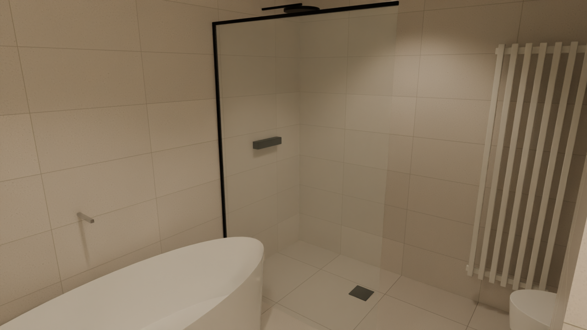

# ZoekDePot v2 — Blender pipeline

The photoreal rebuild described in [`docs/modernization-plan.md`](../docs/modernization-plan.md)
(Option A). The 3D model is **generated by scripts** from the same
`data/model.json` that v1 and the PDF checks use, then finished and baked in
Blender. A web viewer (Phase 3) will load the exported `.glb`.

v1 stays untouched and live until v2 is better.

## Status

| Phase | | |
|---|---|---|
| 0 | Freeze v1 | ✅ `v1` = `main` @ `620add7` (create the `v1` tag on GitHub: Releases → new tag on that commit) |
| 1 | Shell generated in Blender | ✅ walls with real openings, floors/ceilings per room, frames, schuifpuien, railings — checked against `model.json` |
| 2a | Furniture, kitchen, sanitary ware, lamps, wall tiles, plinths | ✅ from `v2/data/furniture.json`, checked against the walls |
| 2b | Photoreal PBR textures | waiting on network access to Poly Haven / ambientCG (see below) |
| 2c | Baked lighting (day / evening / night) for the viewer | next |
| 3–6 | Viewer, features, deploy, extras | — |

## Preview (Phase 2a: furnished, flat placeholder colours, CPU draft)

| | |
|---|---|
|  |  |
|  |  |
|  |  |
|  |  |
|  |  |

Day views: sky + sun for Den Haag at 15:30 in late April, lamps off except
in the windowless gang and the bathroom. `avond`: sunset in the west-north-
west with every lamp on. Surfaces are still flat colours: the tiles, oak,
linen and stone get real scanned textures in Phase 2b. Known open point:
hairline shadow gaps at the slaapkamer 2 alcove pier and the slanted SW wall
(room outline and wall face more than 5 cm apart in `model.json`).

## Furniture

`v2/data/furniture.json` is the layout: one entry per piece with its
position, rotation and size, in the same frame as `model.json`. Pieces marked
`"own": true` are the owners' real ones (both beds 140x200, the dining table
260x100); everything else is a suggestion. Positions come from v1's
walk-tested layout. Edit sizes or positions there, then run
`check_furniture.py`: it fails when a piece hits a wall, door opening or
another piece, or leaves its room.

| Room | Pieces |
|---|---|
| Woonkamer, zithoek | 3-zitsbank 240x95 (linnen), bouclé fauteuil, salontafel 120x60 eiken, tv-meubel 180 + 65" tv, boekenkast 180x210, vloerkleed 300x250, vloerlamp, plant |
| Woonkamer, eethoek | **eigen tafel 260x100**, 8 eiken stoelen met linnen zitkussen, 2 hanglampen, dressoir 120x45 met tafellamp |
| Keuken | keukenopstelling D (wandopstelling + stenen kookeiland met spoelbak en inductie), 3 barkrukken, 2 hanglampen |
| Woonkamer, zuid | 2 linnen fauteuils + bijzettafel bij de grote pui, vloerkleed, vloerlamp, planten, vitrage |
| Slaapkamer 1 | **eigen bed 140x200** met gestoffeerd hoofdbord, nachtkastje + lamp, kledingkast 160x60x230, leesstoel + lamp in de NW-punt, verduisterend linnen |
| Slaapkamer 2 | **eigen bed 140x200**, 2 nachtkastjes, kledingkast 200x60x230, bureau 120x60 met stoel in de nis |
| Badkamers, toilet | vrijstaand bad, inloopdouches, hangtoiletten op voorzetwanden, wastafelmeubels (1 en 2 kommen), designradiatoren, fontein |
| Gang, berging | kapstok + schoenenbank, loper, inbouwspots; WTW, boiler, verdeler, wasmachine + droger |
| Balkons | noord: bistroset + plantenbak; zuid: loungebank, 2 stoelen, tafel, planten |

Furniture objects are `furn.<id>` (hard parts, 4 mm bevel), `furn.<id>.soft`
(upholstery and bedding, rounded), `furn.<id>.blob` (foliage, bulbs) and
`furn.<id>.curtain`; lamps add real light sources `light.<id>` with their
room as a property.

## Textures (Phase 2b) need network access

The cloud environment can reach GitHub, PyPI and npm, but not the free CC0
texture libraries. Add these under **Network access → Custom → Allowed
domains** in the environment settings (keep the default package managers):
`polyhaven.com`, `api.polyhaven.com`, `dl.polyhaven.org`, `ambientcg.com`.

## Running it

Blender **4.5 LTS** is used everywhere (free, blender.org), so cloud and
laptop results match. Two ways to run the same scripts:

```sh
# A) Blender as a Python module (what the cloud sessions and CI use; Python 3.11)
pip install -r v2/blender/requirements.txt
python v2/blender/build_shell.py        # -> v2/build/shell.blend + shell.glb
python v2/blender/check_glb.py          # verifies the glb, writes v2/docs/plan-section.png
python v2/blender/check_furniture.py    # furniture.json vs walls/rooms/each other (no Blender needed)
python v2/blender/build_furniture.py    # -> v2/build/scene.blend + furniture.glb
python v2/blender/render_preview.py     # Cycles stills -> v2/docs/renders/

# B) An installed Blender (the laptop; use the GPU for renders/bakes)
blender -b -P v2/blender/build_shell.py
blender -b -P v2/blender/build_furniture.py
blender -b -P v2/blender/render_preview.py -- --samples 512 --width 1920
```

`v2/build/` is generated and not committed.

## What the shell contains

Model frame = v1 frame: **+X east, +Y up, +Z south, metres**, origin at the
NW corner of the north facade. The `.glb` lands in exactly that frame (see
`P()` in `common.py`).

| Object name | What | Custom properties (glTF `extras`) |
|---|---|---|
| `wall.<room>.<geom>` | Wall surface of one room on one `model.json` segment — the unit for repainting a room or an accent wall | `part=wall`, `room`, `geom` |
| `wall.<room>.x` | Room-side faces not on a single segment (diagonal joints, end caps) | `part=wall`, `room` |
| `wall.corridor.*` | Shared corridor (limewash) | `room=corridor` |
| `wall.reveal` | Reveals and soffits inside openings | `part=reveal` |
| `facade.<geom>` | Outside skin (gevelbekleding) | `part=facade` |
| `floor.<room>` / `ceil.<room>` | One merged outline per room, tucked up to 5 cm under the walls (never into a neighbouring room); thresholds 2 mm proud | `part`, `room`, `finish` |
| `frame.<geom>` / `dorpel.<geom>` | Nestelkozijnen (white), voordeur (hardwood), kunststeen dorpel at wet rooms | `geom` |
| `pui.<geom>` | Hef-schuifpui: fixed + sliding pane, open where v1's walkable gap is | `geom` |
| `railing.<geom>` / `screen.<geom>` | Balkonhek, privacy screens, slab edges | `geom` |
| `glass.*` | All glazing (alpha-blended) | `part=glass` |
| `slab.upper` / `slab.lower` | Structural slabs that seal the voids; never visible | `bake=false` |
| `building.*`, `ground` | Storeys above/below, neighbours' balconies, forest floor | |
| `plinth.<room>` | 7 cm white plinth along the painted walls | `room` |

Wet rooms: badkamers are tiled to the ceiling, the toilet behind the pan
(Technische Omschrijving); those wall objects carry `finish=tile`.

How the walls are made: each solid segment of `model.json` becomes a box
(slab to slab, corners closed), all boxes are merged with Blender's exact
boolean, the rough openings for doors (2.36 m incl. kozijn), side light and
schuifpuien (2.58 m) are cut out, and the result is split per room and
per segment by looking at which room each face points into.

Materials are named placeholders (`M_plaster`, `M_floor_hout`, …).
Phase 2b swaps them for textured PBR materials without touching the geometry.

## Checks

`check_glb.py` re-imports the exported `.glb` and verifies:

1. 763 points on the faces of every wall segment lie on the exported wall
   surface (worst: 5 mm);
2. every door, side light and schuifpui is open over its full width and has its
   lintel at the right height;
3. every room has a floor and a ceiling, and the model sits where v1 does.

`model.json` itself is kept within 0.12 m of the PDF by `tools/compare-to-pdf.py`,
so the `.glb` matches the sales drawing too. `v2/docs/plan-section.png` shows it:
a cut through the exported walls at 1.2 m (red) over the drawing.

`check_furniture.py` checks `v2/data/furniture.json`: every piece clear of
the walls, door openings, sliding doors and railings, inside its own room,
and clear of the other pieces.

CI (`.github/workflows/v2-shell.yml`) runs the builds and all checks on every
change to `data/model.json`, `v2/blender/` or `v2/data/`.
