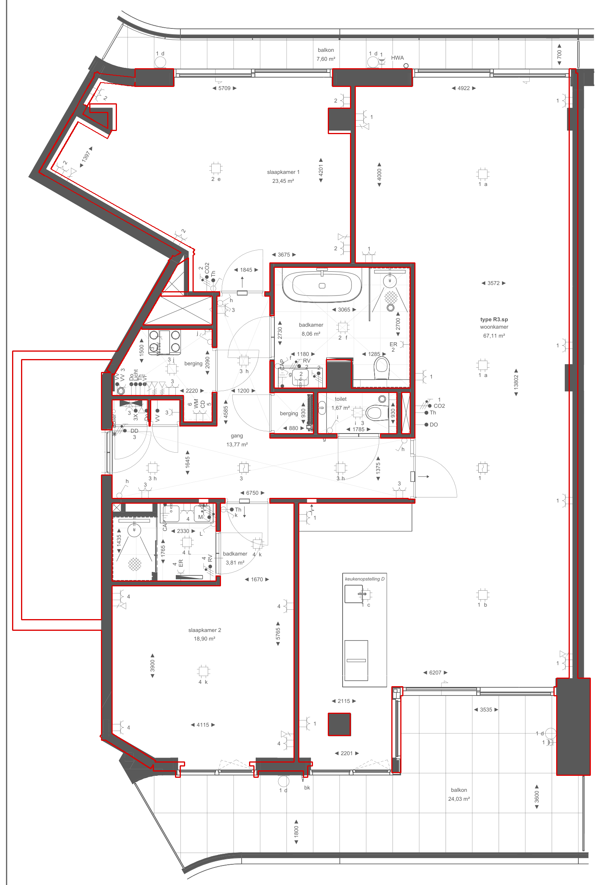

# ZoekDePot v2 — Blender pipeline

The photoreal rebuild described in [`docs/modernization-plan.md`](../docs/modernization-plan.md)
(Option A). The 3D model is **generated by scripts** from the same
`data/model.json` that v1 and the PDF checks use, then finished and baked in
Blender. A web viewer (Phase 3) will load the exported `.glb`.

v1 stays untouched and live until v2 is better.

## Status

| Phase | | |
|---|---|---|
| 0 | Freeze v1 | ✅ `v1` = `main` @ `620add7` (create the `v1` tag on GitHub: Releases → new tag on that commit) |
| 1 | Shell generated in Blender | ✅ walls with real openings, floors/ceilings per room, frames, schuifpuien, railings — checked against `model.json` |
| 2 | Materials, furniture, baked light | next |
| 3–6 | Viewer, features, deploy, extras | — |

## Preview (Phase 1: geometry + placeholder materials, CPU draft)

| | |
|---|---|
|  |  |
|  |  |
|  |  |

Lighting is daylight only (sky + sun for Den Haag, 15:30 in late April), so
windowless spaces such as the gang stay dark until Phase 2 adds the lamps.
Materials are flat placeholders. Known open points for Phase 2:
hairline shadow gaps at the slaapkamer 2 alcove pier and the slanted SW
wall (room outline and wall face more than 5 cm apart in `model.json`);
plinths, wall tiles, kitchen and sanitary ware are not in the shell yet.

## Running it

Blender **4.5 LTS** is used everywhere (free, blender.org), so cloud and
laptop results match. Two ways to run the same scripts:

```sh
# A) Blender as a Python module (what the cloud sessions and CI use; Python 3.11)
pip install -r v2/blender/requirements.txt
python v2/blender/build_shell.py        # -> v2/build/shell.blend + shell.glb
python v2/blender/check_glb.py          # verifies the glb, writes v2/docs/plan-section.png
python v2/blender/render_preview.py     # Cycles stills -> v2/docs/renders/

# B) An installed Blender (the laptop; use the GPU for renders/bakes)
blender -b -P v2/blender/build_shell.py
blender -b -P v2/blender/render_preview.py -- --samples 512 --width 1920
```

`v2/build/` is generated and not committed.

## What the shell contains

Model frame = v1 frame: **+X east, +Y up, +Z south, metres**, origin at the
NW corner of the north facade. The `.glb` lands in exactly that frame (see
`P()` in `common.py`).

| Object name | What | Custom properties (glTF `extras`) |
|---|---|---|
| `wall.<room>.<geom>` | Wall surface of one room on one `model.json` segment — the unit for repainting a room or an accent wall | `part=wall`, `room`, `geom` |
| `wall.<room>.x` | Room-side faces not on a single segment (diagonal joints, end caps) | `part=wall`, `room` |
| `wall.corridor.*` | Shared corridor (limewash) | `room=corridor` |
| `wall.reveal` | Reveals and soffits inside openings | `part=reveal` |
| `facade.<geom>` | Outside skin (gevelbekleding) | `part=facade` |
| `floor.<room>` / `ceil.<room>` | One merged outline per room, tucked up to 5 cm under the walls (never into a neighbouring room); thresholds 2 mm proud | `part`, `room`, `finish` |
| `frame.<geom>` / `dorpel.<geom>` | Nestelkozijnen (white), voordeur (hardwood), kunststeen dorpel at wet rooms | `geom` |
| `pui.<geom>` | Hef-schuifpui: fixed + sliding pane, open where v1's walkable gap is | `geom` |
| `railing.<geom>` / `screen.<geom>` | Balkonhek, privacy screens, slab edges | `geom` |
| `glass.*` | All glazing (alpha-blended) | `part=glass` |
| `slab.upper` / `slab.lower` | Structural slabs that seal the voids; never visible | `bake=false` |
| `building.*`, `ground` | Storeys above/below, neighbours' balconies, forest floor | |

How the walls are made: each solid segment of `model.json` becomes a box
(slab to slab, corners closed), all boxes are merged with Blender's exact
boolean, the rough openings for doors (2.36 m incl. kozijn), side light and
schuifpuien (2.58 m) are cut out, and the result is split per room and
per segment by looking at which room each face points into.

Materials are named placeholders (`M_plaster`, `M_floor_hout`, …).
Phase 2 swaps them for textured PBR materials without touching the geometry.

## Checks

`check_glb.py` re-imports the exported `.glb` and verifies:

1. 763 points on the faces of every wall segment lie on the exported wall
   surface (worst: 5 mm);
2. every door, side light and schuifpui is open over its full width and has its
   lintel at the right height;
3. every room has a floor and a ceiling, and the model sits where v1 does.

`model.json` itself is kept within 0.12 m of the PDF by `tools/compare-to-pdf.py`,
so the `.glb` matches the sales drawing too. `v2/docs/plan-section.png` shows it:
a cut through the exported walls at 1.2 m (red) over the drawing.

CI (`.github/workflows/v2-shell.yml`) runs the build + check on every change
to `data/model.json` or `v2/blender/`.
